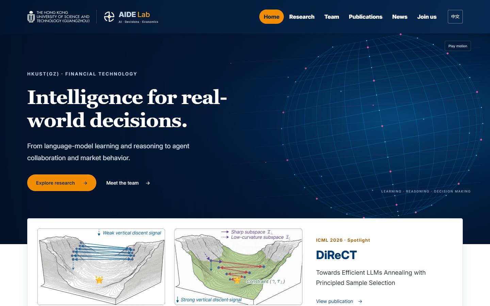

# AIDE Lab · HKUST(GZ)

[在线主页](https://kzczc.github.io/lab-homepage/) · [English](README.en.md) · [设计参照](planning/DESIGN.md)

面向香港科技大学（广州）张光老师的 **AIDE Lab（智能决策与经济研究实验室）** 多页面研究团队网站。



**首页 · 研究 · 团队 · 论文 · 动态 · 联系与加入**

整体视觉以西湖大学 MedAI 为主要参照，团队页参考 MobiX，研究图与字体参考 CIS。采用 AIDE 的深蓝、橙色节点和四向汇聚标志，配合浅灰分区、Inter、本地字体与可暂停的线网动效。Logo 说明见 [BRAND.md](planning/BRAND.md)。

主体包含 3 条研究方向、6 组代表研究、17 条已发表或已接收成果、11 条论文录用动态、8 名当前学生以及 22 条已完成学位记录；其中 EMNLP 2026 接收 3 篇，当前成员使用不同 Minion 临时头像占位。首次访问默认英文，手动切换后跨页保留。论文图片可放大并切换原始尺寸；论文支持作者、年份、主题、标题筛选及 BibTeX 复制/下载。成果来源区别见 [SOURCES.md](planning/SOURCES.md)。

## 本地使用

Node.js 18+，无第三方构建依赖。

```sh
npm run build
npm start
```

打开 http://127.0.0.1:61332 。编辑 `content/site.json`，运行构建后同时提交源数据和 `docs/`。GitHub Pages 从 `main:/docs` 发布。

| 文件 | 用途 |
|---|---|
| content/site.json | 双语内容、论文、成员和项目 |
| content/asset-sources.json | 研究图、校园图片、字体来源 |
| scripts/build-pages.cjs | 六个独立页面的构建器 |
| docs/site-v2.css | 全站视觉和响应式布局 |
| docs/site-v2.js | 语言、论文筛选、导航和动效 |
| planning/DESIGN.md | 设计参照与页面映射 |
| planning/MATERIALS.md | 尚需收集的素材 |
| planning/DEPLOYMENT.md | GitHub 与 key 使用方式 |

GitHub 凭据只在本地发布进程使用；这个静态站不需要模型 API key。字体 OFL 许可证随源码提供，图片保留原权利。预览的 noindex 不限制访问。
